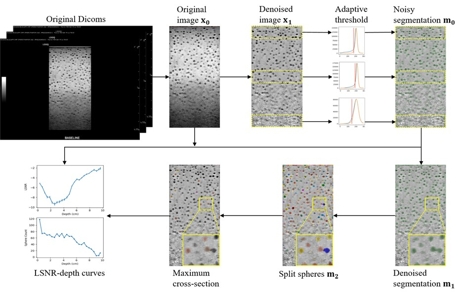
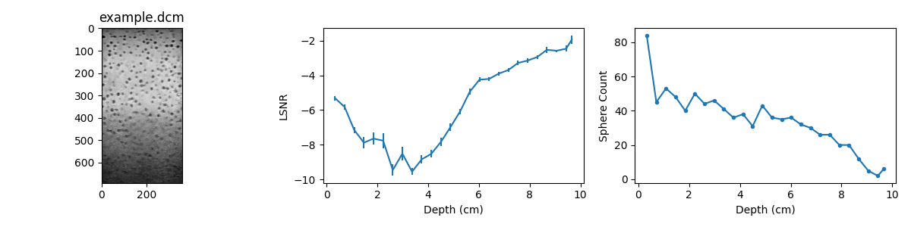

# Ultrasound LSNR Calculation from RHSP

This is the official implementation for the paper "**Assessing Imaging Performance of Ultrasound Systems Using a Random Hypoechoic Sphere Phantom with Freehand Scanning**" published in Medical Physics. If you make use of this code in your research, please ensure that you cite the corresponding publication.

**Citation**: Yu B, Wu D, Baiu C, Lu Z. Assessing imaging performance of ultrasound systems using a random hypoechoic sphere phantom with freehand scanning. Med Phys. 2026;53:e70278. https://doi.org/10.1002/mp.70278 

## Overview

Given the DICOM of a ultrasound cine acquisition of a Random Hypoechoic Sphere Phantom (RHSP), this code will automatically calculate the lesion signal-to-noise ratio (LSNR) versus depth curve. The cine acquisition can be done with freehand by scanning the RHSP. The LSNR curve is useful for daily ultrasound quality check. 



## Environment Configuration

A GPU is needed to run the code because of a gpu-based 3D non-local mean (NLM) denoising algorithm, which would be otherwise too slow on a CPU. Any GPU that supports CUDA will work -- it only requires a very limited amount of GPU memory. It is suggested to run the code in the provided docker container which has been verified to be compatible with the custom-built GPU-based 3D NLM. 

First you should have Docker installed for your system. Then, to build the docker image, run `./build_docker.sh` from Linux or Windows Subsystem for Linux (WSL). It will create the image `rhsp_lsnr:1.0.0`.

To start the container, run `./start_docker.sh`. Then you can `cd /workspace/rhsp_lsnr` to the project root. 

## Execute Code

An example DICOM is provided at `data/example.dcm`, along with the expected final output `data/output.csv`. To run the code, simply execute from the project root inside the docker container:

```bash
python main.py --input_filename=example.dcm --output_dir=output
```

It will automatically process `data/example.dcm` and generate the output and intermediate results under folder `data/output`.

See `main.py` for more options and configurations for code execution. 

## Results

The main output is `cnr_curves.csv` under the output folder. It includes multiple rows, where each row represent the data for LSNR at a certain depth.

| Column | Description |
|--------|-------------|
| Depth  | The depth in cm from the surface for this row of data. |
| CNR    | The averaged CNR of all spheres in the current slab. LSNR = -CNR. |
| CNR_std | The standard deviation of the CNRs from each sphere in the current slab. |
| Contrast | The averaged contrast of all spheres in the current slab. |
| Noise  | The average background noise of all spheres in the current slab. |
| Nballs | The number of detected spheres in the current slab. |

Note that `CNR_std` is the raw SD. To convert it to the error bar in the plot, one should use `CNR_std / sqrt(Nballs)` to convert it to the uncertainty of the mean. 

The data in the `cnr_curves.csv` can be used to plot the LSNR versus depth curve and the sphere count versus depth curve:

```python
plt.errorbar(depths, -cnrs, yerr=cnr_stds / np.sqrt(nballs))
plt.xlabel('Depth (cm)')
plt.ylabel('LSNR')
```

```python
plt.plot(depths, nballs, '.-')
plt.xlabel('Depth (cm)')
plt.ylabel('Sphere Count')
```



## Intermediate Results

By default, the intermediate results will be saved to provide step-by-step processing information. They are saved under `data/output/intermediate`. The intermediate results include:

| Filename | Description |
|----------|-------------|
| example.dcm.nii.gz | The effective volume extracted from the input DICOM |
| origin.nii.gz | unprocessed effective volume after removing the starting and ending rows |
| nlm.nii.gz | After NLM denoising |
| n4.nii.gz | After N4 correction |
| mask.seg.nrrd | The raw segmentation results |
| mask_denoised.seg.nrrd | After applying opening |
| peak_morph_mask.seg.nrrd | Seeds for watershed |
| labels.seg.nrrd | The labeled spheres after watershed | 
| label_info.csv | Statistics for each labeled sphere |
| label_max.seg.nrrd | The maximum cross section for each sphere |
| labels_large.seg.nrrd | Spheres that are too large and removed from analysis |
| labels_small.seg.nrrd | Spheres that are too small and removed from analysis |
| labels_preserve.seg.nrrd | Spheres that are preserved for the analysis |
| cnr_curve.png | The LSNR and sphere count curves |
| contrast_noise_curve.png | The contrast and noise curves |
